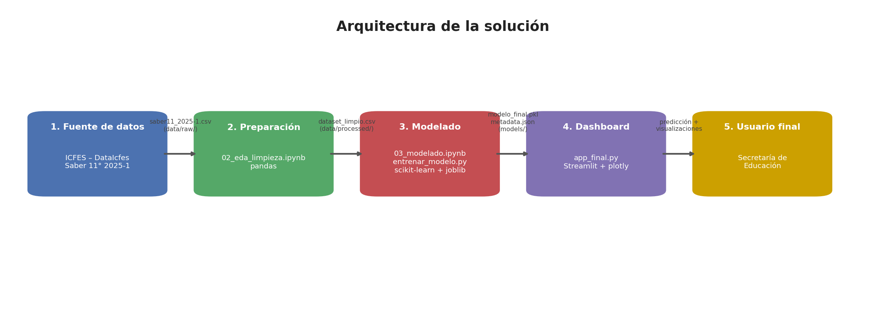

# Arquitectura de la solución

El sistema sigue un flujo lineal desde los datos crudos del ICFES hasta el dashboard que
consume la Secretaría de Educación.

## Componentes del sistema y su función
1. **Fuente de datos (ICFES – DataIcfes):** resultados del examen Saber 11° 2025-1; el
   archivo crudo se guarda en `data/raw/saber11_2025-1.csv`.
2. **Preparación de datos (`notebooks/02_eda_limpieza.ipynb`):** limpia los datos (corrige
   inconsistencias, elimina nulos), crea la variable objetivo y genera el dataset procesado
   en `data/processed/dataset_limpio.csv`.
3. **Modelado (`notebooks/03_modelado.ipynb` y `src/ml/entrenar_modelo.py`):** entrena y
   compara dos modelos, selecciona la Regresión Logística, la evalúa sobre el conjunto de
   prueba y la serializa en `models/modelo_final.pkl`, junto con sus métricas en
   `models/model_metadata.json`.
4. **Dashboard (`app_final.py`):** aplicación web en Streamlit que carga el dataset procesado,
   el modelo serializado y sus métricas; ofrece análisis exploratorio, un mapa de prioridad
   por municipio y un formulario de predicción.
5. **Usuario final:** la Secretaría de Educación, que usa el dashboard para focalizar
   programas de refuerzo.

## Flujo de datos
Fuente (ICFES) → `data/raw/` → limpieza → `data/processed/dataset_limpio.csv` → entrenamiento
→ `models/modelo_final.pkl` + `model_metadata.json` → `app_final.py` (Streamlit) → usuario.

## Tecnologías por capa
| Capa | Tecnología |
|---|---|
| Manejo de datos | Python, pandas |
| Modelado | scikit-learn, joblib |
| Dashboard y visualización | Streamlit, plotly |
| Mapa geográfico | GeoJSON + plotly |
| Control de versiones | Git y GitHub |
| Entorno | Entorno virtual (venv) |